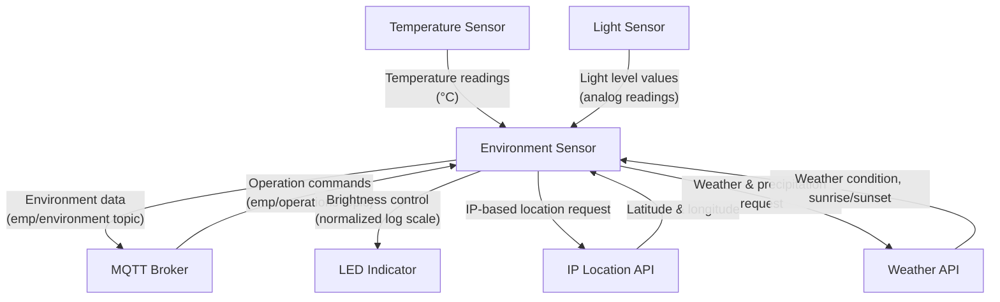

# Sensor Raspberry Pi
Retrieves ambient information including:
- Temperature
- Brightness
- Using IP address geolocation:
  - Weather
  - Time
  - Sunrise/Sunset
---

```mermaid
flowchart TD
    ES[Environment Sensor] 
    MQTT[MQTT Broker]
    TS[Temperature Sensor]
    LS[Light Sensor]
    LED[LED Indicator]
    IPAPI[IP Location API]
    WAPI[Weather API]
    
    MQTT -->|"Operation commands\n(emp/operations topic)"| ES
    ES -->|"Environment data\n(emp/environment topic)"| MQTT
    
    TS -->|"Temperature readings\n(°C)"| ES
    LS -->|"Light level values\n(analog readings)"| ES
    ES -->|"Brightness control\n(normalized log scale)"| LED
    
    ES -->|"IP-based location request"| IPAPI
    IPAPI -->|"Latitude & longitude"| ES
    
    ES -->|"Weather & precipitation request"| WAPI
    WAPI -->|"Weather condition, sunrise/sunset"| ES
```
