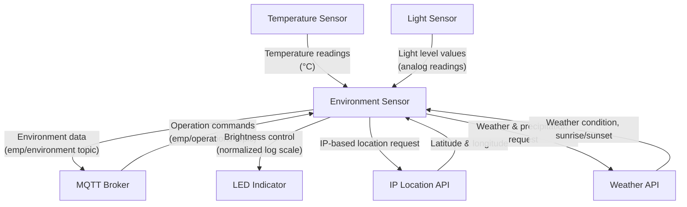

# Sensor Program (`get_environment.py`)
Retrieves environmental information for the current location and transmits it to an MQTT broker.

## Data Transmitted
- Pi ID (internal identifier to distinguish between multiple devices)
- Precipitation status (rain, snow, hail, or drizzle, based on weather readings at the IP-traced location)
- Sunrise time (based on the IP-traced location)
- Sunset time (based on the IP-traced location)
- Time zone (based on the IP-traced location)
- Temperature Reading (°C)
- Light level reading
- Timestamp
---

